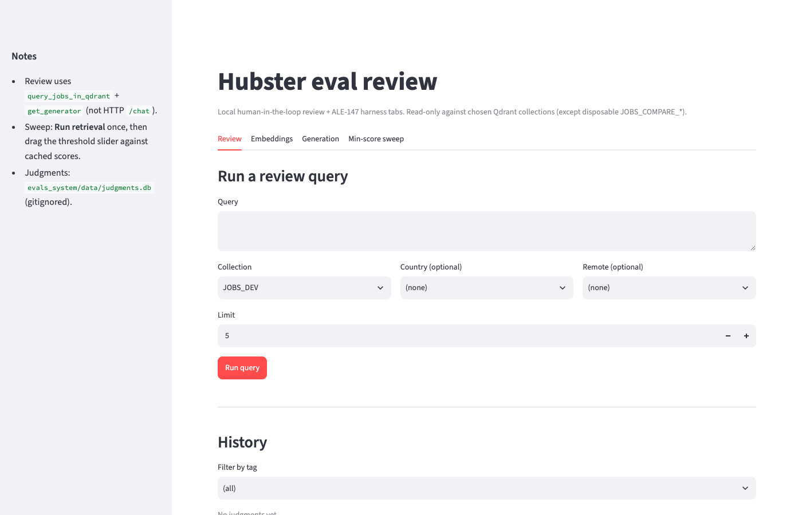
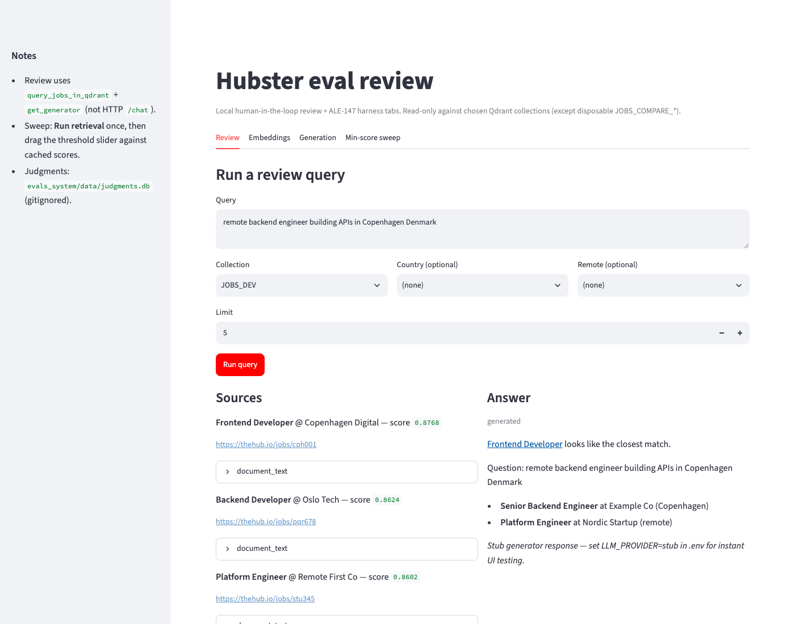
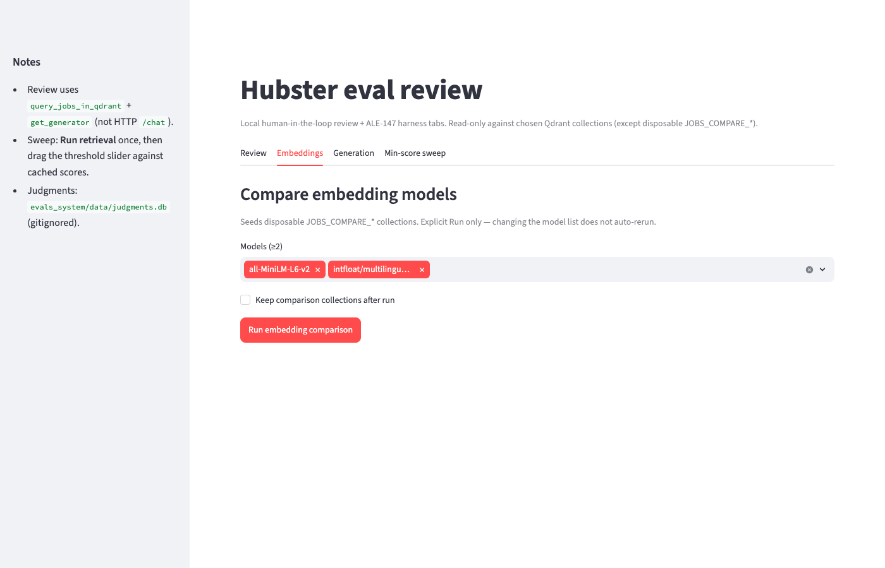
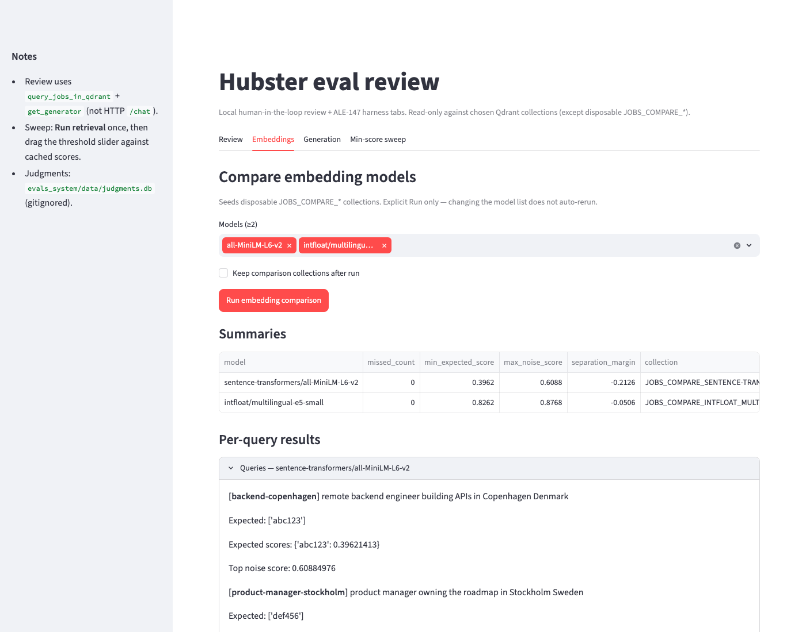
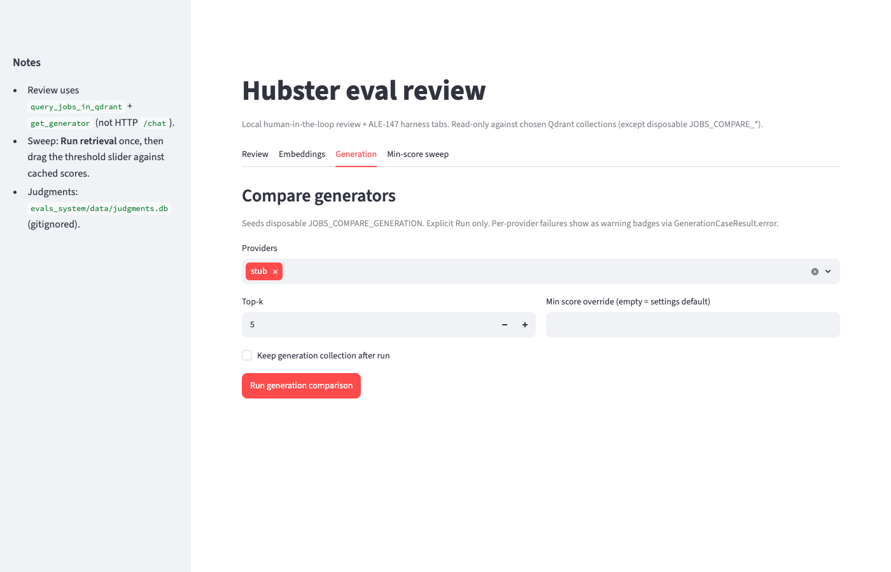
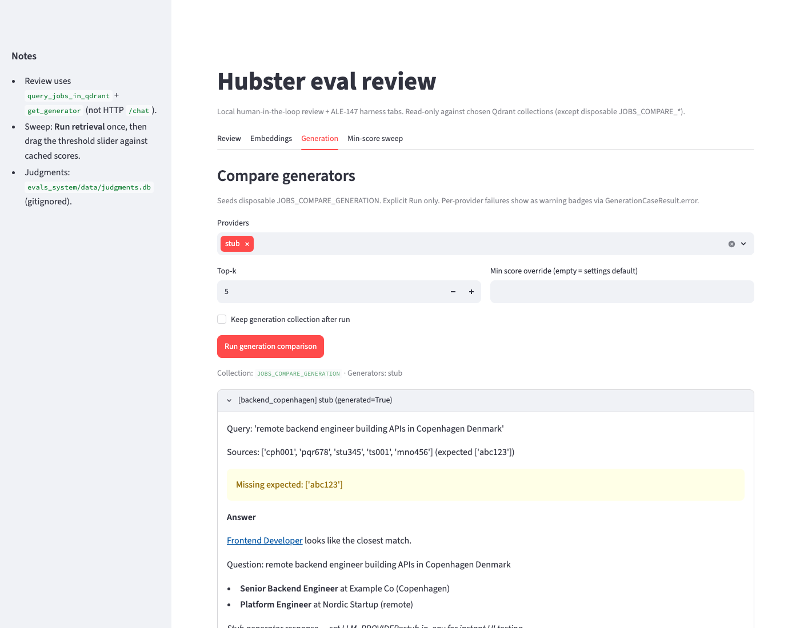
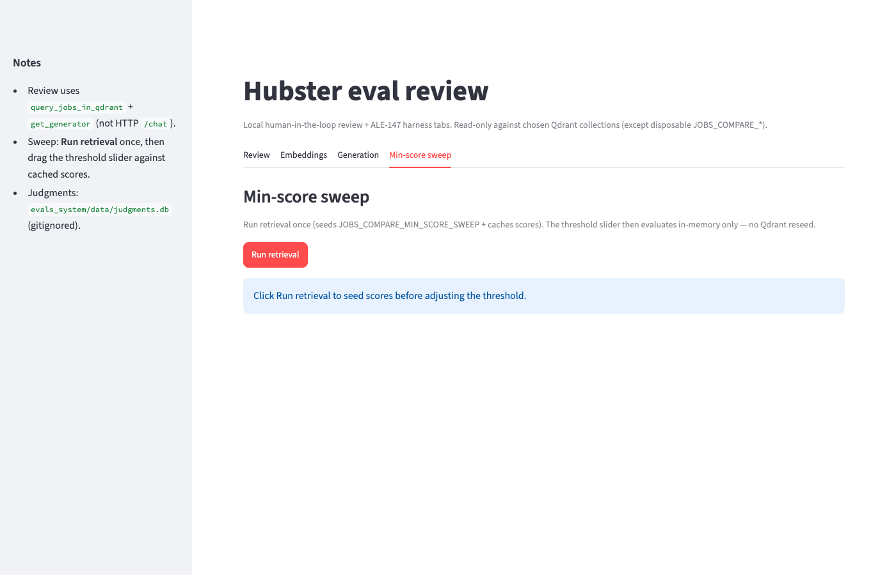
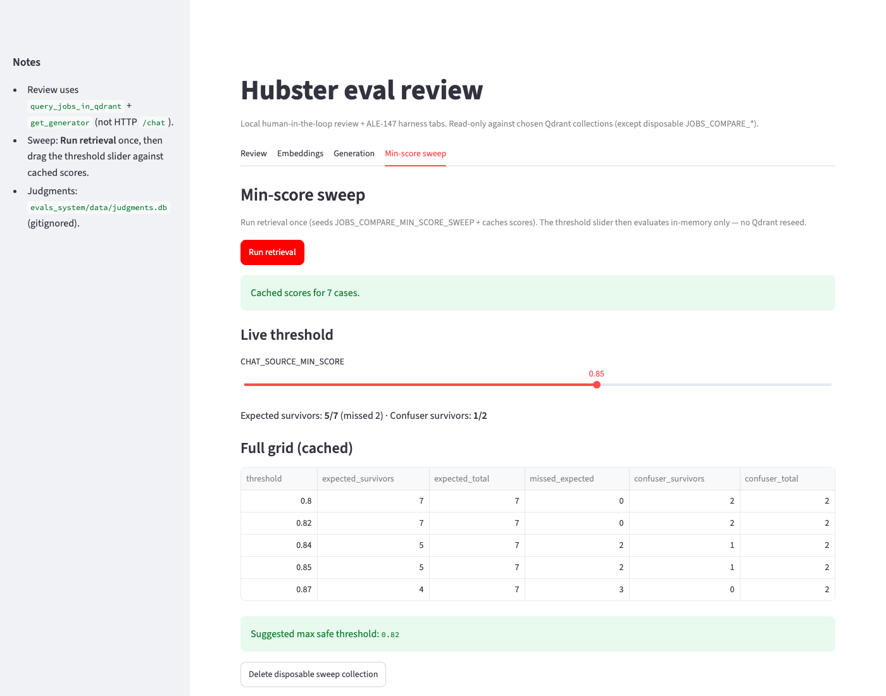

# Manual eval review guide

How to use the four tabs in this UI when exploring retrieval/generation quality.
For how to launch the app, see [README.md](README.md).

**Prefer `JOBS_DEV` for Review-tab exploration** when you want stable, fixture-backed
examples (same corpus as `golden_jobs.json` / `golden_queries.json`). Use
`JOBS_ON_THE_HUB` when you are deliberately probing production-scale failure modes.

Screenshots below were captured against the golden fixture corpus (`JOBS_DEV`
seeded from `golden_jobs.json`, plus disposable `JOBS_COMPARE_*` collections).
Fixture company names (`Acme Corp`, `Copenhagen Digital`, …) are intentional —
do not replace these with production screenshots.



## How the four tabs relate to pytest

| Surface | Role |
|---------|------|
| `pytest -m retrieval` / `pytest -m generation` | Catch **known** regressions against the golden set (pass/fail). |
| This UI (`evals_system/`) | Surface **new** failure modes worth promoting into the golden set. |
| `evals/` + `scripts/` | Same comparison/sweep logic as the Embeddings / Generation / Sweep tabs, as CLI. |

Use pytest as the regression gate. Use this UI (or the CLI wrappers) when you are
comparing models/providers, tuning `CHAT_SOURCE_MIN_SCORE`, or manually tagging
queries that look wrong before writing a new golden case.

---

## Review

Human-in-the-loop: run one query against a chosen collection, inspect sources +
answer, tag the outcome, replay later.

### Form fields

| Field | Meaning |
|-------|---------|
| **Query** | Free-text question (same shape as `/chat`). |
| **Collection** | `JOBS_DEV` and/or `JOBS_ON_THE_HUB` if they exist on your Qdrant cluster. |
| **Country / Remote** | Optional payload filters (same semantics as `/chat`). |
| **Limit** | Max retrieval hits before the min-score floor is applied (default 5). |

### What "Run query" actually calls

Not HTTP `POST /chat`. The tab calls `query_jobs_in_qdrant` + `get_generator`
directly (same building blocks as the API), then applies
`filter_chat_retrieval_points` with `CHAT_SOURCE_MIN_SCORE` and
`sanitize_answer_links`. That means you need Qdrant + LLM credentials in `.env`,
but you do **not** need the FastAPI server running.

### Reading Sources / Answer



- **Sources** (left): hits that survived the min-score floor, with score and
  expandable `document_text`. Empty → "No sources above the min-score floor" and
  the answer is the standard no-match fallback (`generated=false`).
- **Answer** (right): model output grounded on those sources, or the fallback
  message when nothing cleared the floor.

A **good** result: expected job(s) appear as top sources with scores comfortably
above the floor; the answer cites only those jobs and does not invent roles.
A **concerning** result: wrong role/company in the top sources, scores clustered
near the floor, or an answer that names a job/URL not present in Sources.

The screenshot above is a concerning Review hit on purpose: the golden query asks
for a remote backend engineer in Copenhagen, but the top source is a
**Frontend Developer** (`cph001`) — the same role-confusion pattern covered by
`role_confusion_cases` in `golden_queries.json`.

### Judgments

Tag `good` / `bad` / `partial`, optional note, **Save judgment**. Rows live in
`evals_system/data/judgments.db` (gitignored local SQLite).

**History** lists saved rows; **Replay** re-runs the stored query against the same
collection and diffs answer text + source ids/scores — useful after a model or
threshold change.

---

## Embeddings

Side-by-side embedding model comparison via `evals.compare_embedding_models`.



### What the run does

1. Seeds a disposable `JOBS_COMPARE_*` collection per selected model from
   `golden_jobs.json`.
2. Runs `golden_queries.json` against each collection.
3. Deletes the disposable collections unless **Keep comparison collections** is
   checked.

**Explicit Run only** — changing the model multiselect does not re-run. Click
**Run embedding comparison** again after changing the list.

The tool only compares the models you select. To evaluate a migration, **include
the current production model as a baseline** in the same run; it is not added
automatically.

### Reading the summary metrics

| Metric | Meaning |
|--------|---------|
| `missed_count` | How many expected golden job ids failed to appear in top-k across queries. |
| `min_expected_score` | Lowest score among expected hits that did appear. |
| `max_noise_score` | Highest score among non-expected ("noise") hits. |
| `separation_margin` | `min_expected_score − max_noise_score`. |

**Positive margin** — expected hits reliably outscore noise; you can place a
threshold between them.

**Negative margin** — some noise outscores a correct answer. At some threshold
settings, a confuser can survive while an expected hit is dropped (or both
survive and the ranking looks wrong).

Expand **Queries — {model}** to see per-query `expected_scores`, `top_noise_score`,
and any `all_missing` ids.

### Worked example (what a bad margin looks like)



On a golden-set run that includes both `sentence-transformers/all-MiniLM-L6-v2`
and production `intfloat/multilingual-e5-small`:

| model | missed_count | min_expected_score | max_noise_score | separation_margin |
|-------|--------------|--------------------|-----------------|-------------------|
| `…/all-MiniLM-L6-v2` | 0 | ~0.40 | ~0.61 | **≈ −0.21** |
| `intfloat/multilingual-e5-small` | 0 | ~0.83 | ~0.88 | ≈ −0.05 |

MiniLM’s `missed_count=0` looks fine until you read the margin: noise still peaks
~0.21 above the weakest expected hit. Expand **Queries — …MiniLM…** and open
`backend-copenhagen`: expected `abc123` scores ~0.40 while top noise is ~0.61 —
noise outranking a correct answer, not a miss.

Prefer reading margins relative to the production baseline in the **same** table,
not absolute scores across unrelated runs.

---

## Generation

Side-by-side generator comparison via `evals.compare_generators` on
`golden_generation.json`.



### Controls

| Control | Meaning |
|---------|---------|
| **Providers** | Presets such as `stub`, `gemini`, `ollama`, `ollama:qwen3:8b`, `gemini:gemini-2.0-flash`. |
| **Top-k** | Retrieval depth before min-score filtering. |
| **Min score override** | Empty → use settings default; otherwise override for this run only. |
| **Keep generation collection** | Keep disposable `JOBS_COMPARE_GENERATION` after the run. |

Explicit Run only (same caveat as Embeddings).

### Reading case results



Each expander is one golden case × one provider (`GenerationCaseResult`):

- **`GenerationCaseResult.error`** — provider failure (config, rate limit, unreachable
  Ollama, etc.). Shown as a warning badge; do not treat an empty answer with an
  error as a grounding failure.
- **`missing_expected_source_ids`** — expected job ids were **not** in the retrieved
  context fed to the generator. If **every** provider shares the same missing set,
  that is a **retrieval** problem (wrong sources for everyone). If sources match
  across providers but answers diverge in quality/grounding, that is a
  **generation** problem.
- **`ungrounded_urls` / `ungrounded_phrases`** — answer cites material not present
  in the retrieved sources (hallucination / poor grounding signal).

In the screenshot, `[backend_copenhagen]` shows
`Missing expected: ['abc123']` while other fixture ids filled top-k — flag that
as retrieval before judging the stub answer text.

### Watch-for: same sources, different honesty

When comparing providers on identical retrieval (no `missing_expected_source_ids`),
watch for one model fabricating a job or claim while another correctly declines.
A 2026-07-16 session saw `ollama:qwen3:8b` appear to invent a role not present in
its own sources while `gemini` declined on the same context — treat that pattern
as a generation-grounding flag. If you can reproduce it on `JOBS_DEV` /
`golden_generation.json`, promote it into a golden case (or open a follow-up
ticket); do not rely on a one-off production screenshot.

---

## Min-score sweep

Explore candidate `CHAT_SOURCE_MIN_SCORE` values without re-embedding on every
slider move.



### Two-phase flow

1. **Run retrieval** — seeds disposable `JOBS_COMPARE_MIN_SCORE_SWEEP` with the
   configured `EMBEDDING_MODEL`, runs golden (+ role-confusion) cases once, and
   **caches hit scores in session state**.
2. **Threshold slider** — re-evaluates the cached scores in memory only (no Qdrant
   reseed). Drag freely; cost is CPU, not embedding API calls.

Delete the disposable collection with the cleanup button when finished.

### Reading the grid



| Column | Meaning |
|--------|---------|
| `expected_survivors` / `expected_total` | How many expected golden hits still clear this threshold. |
| `missed_expected` | Expected hits dropped by the floor. |
| `confuser_survivors` / `confuser_total` | How many known confuser jobs still clear the floor. |

**Suggested max safe threshold** = largest candidate where `missed_expected == 0`
(no expected-hit loss). It does **not** guarantee confuser rejection.

A clean read requires **both** columns: e.g. at `0.85` the screenshot shows
`Expected survivors: 5/7 (missed 2) · Confuser survivors: 1/2` — the floor is
already dropping expected hits while a confuser still survives. Prefer a
threshold where expected survivors stay complete **and** confuser survivors drop
as far as the score separation allows. If expected and confuser scores overlap,
no single floor fixes ranking — that is an embedding/corpus problem (use the
Embeddings tab), not a threshold tweak.

---

## Suggested workflow

1. **Review** on `JOBS_DEV` (or production when hunting live bugs) → tag surprises.
2. **Embeddings** — include production model + candidates; chase negative
   `separation_margin` and non-zero `missed_count`.
3. **Min-score sweep** — after trusting the embedding, pick a floor that keeps
   expected hits and cuts confusers.
4. **Generation** — compare providers on the same retrieval; separate retrieval
   misses from grounding/provider errors.
5. Promote durable findings into `tests/fixtures/` and cover them with
   `pytest -m retrieval` / `generation`.

## Regenerating screenshots

With Qdrant reachable and `JOBS_DEV` seeded from golden fixtures:

```bash
# Terminal A
LLM_PROVIDER=stub uv run --group eval-ui streamlit run evals_system/app.py \
  --server.port 8502 --server.headless true

# Terminal B
uv run --with playwright python evals_system/assets/_capture_screenshots.py
```

Keep production collections out of these shots — the guide should stay fixture-stable.
